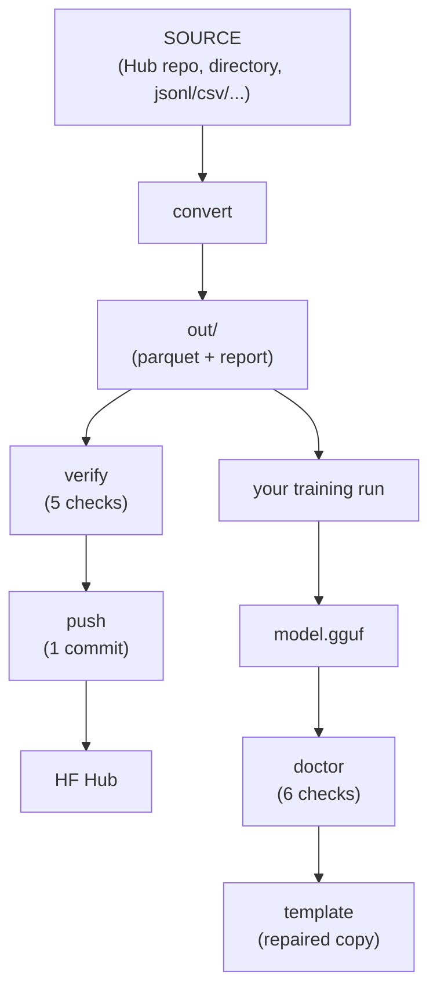

# mocha.py

One command-line tool that turns **any** chat or instruction dataset into a training-ready `openai_messages` dataset, proves the conversion did not lose anything, publishes it, and keeps tool calling alive in the model that comes out the other end.

[](https://www.python.org/)
[](#requirements)
[](#licensing)
[](#project-layout)
[](#commands)  
[](#input-formats)
[](#convert)
[](#output-layout)
[](#output-layout)  
[](#verify)
[](#doctor)
[](#push)
[](#template)

[](https://github.com/nekoo-moe/mocha.py/actions)
[](https://github.com/nekoo-moe/mocha.py/graphs/contributors)
[](https://github.com/nekoo-moe/mocha.py/commits)
[](https://github.com/nekoo-moe/mocha.py/commits)
[](https://github.com/nekoo-moe/mocha.py/issues)

**Contents** --
[Why](#why) |
[Features](#features) |
[Requirements](#requirements) |
[Installation](#installation) |
[Quick start](#quick-start) |
[Commands](#commands)
([convert](#convert) - [verify](#verify) - [push](#push) - [doctor](#doctor) -
[template](#template) - [login](#login)) |
[Output layout](#output-layout) |
[Recipes](#recipes) |
[Project layout](#project-layout) |
[FAQ](#faq) |
[Limitations](#limitations) |
[Licensing](#licensing)

## Why

Supervised datasets arrive in whatever shape their author liked. Trainers want exactly one shape. So every fine-tune starts with the same throwaway script, and that script usually gets three things wrong.

**It reads the wrong rows.** A dataset config is a glob over parquet files. When a repository still carries shards from an earlier revision, the glob matches both generations and you train on duplicates. Worse, a card that declares configs without a `data_files` mapping gives every config the same glob, so every configreturns the whole repository. One real example: a 57,937-row corpus whose page reports 22,888,992 rows, where asking for the `sft_math` config hands you all 187 parquet files, mixed schemas included. Nothing in the loader tells you.

**It quietly drops things.** Reasoning traces stored in a separate field are ignored by most chat templates, so they never reach the loss. Tool schemas are free-form JSON Schema, which infers a different Arrow struct in every shard, so the shards refuse to concatenate. Both problems surface late.

**It stops caring at export.** llama.cpp, Ollama and LM Studio drive tool calling entirely from the Jinja template in GGUF metadata. Converters routinely write a template with no `tools` branch, and a model fine-tuned on 5,000 tool-calling examples suddenly cannot be shown a tool.

mocha.py is that throwaway script, written once and checked.

| | Typical ad hoc script | mocha.py |
| :--- | :--- | :--- |
| **Input shapes** | one, whichever you wrote it for | five, detected, every column overridable |
| **Shard selection** | whatever the glob matched | resolved per config, overlapping sets reported and dropped |
| **Revision** | follows `main`, changes under you | pinned and recorded in the report |
| **Schema** | whatever Arrow inferred per run | one uniform schema, shards concatenate |
| **Proof** | the loss curve looked fine | five independent checks, nonzero exit on failure |
| **Publishing** | `push_to_hub`, hope the card is right | card generated from the reports and the files on disk |
| **After export** | tool calling dies silently | `doctor` finds it, `template` repairs it |

The whole pipeline, end to end:



## Features

- **Five input formats, detected.** `messages` role/content lists, the same serialized as JSON, ShareGPT `conversations` with from/value turns, Alpaca `instruction`/`input`/`output`, and plain prompt/completion pairs. Every column name can be overridden when detection guesses wrong.
- **Any source.** A Hugging Face repo id, a local directory, or a single `.jsonl`, `.json`, `.csv`, `.tsv`, `.parquet`, `.txt` or `.arrow` file.
- **Explicit shard resolution where it helps.** On Hub repos with a parquet layout, files are resolved by name, the revision is pinned, and overlapping shard sets are reported and excluded. Anything else falls back to `load_dataset` with a warning that the protection is off.
- **Verification that does not trust the converter.** Schema identity across shards, `CastError`-free concatenation, the OpenAI message contract, source-text fidelity re-derived from the pinned source, and `apply_chat_template` across tokenizers.
- **Tool calling handled end to end.** Tool definitions survive Arrow, tool schemas are proven to reach the rendered prompt, and a broken GGUF template can be replaced after training without retraining or re-quantising.
- **Publishing that cannot drift.** One commit per invocation, shards listed by filename rather than globbed, and superseded files pruned from the directories being published.
- **Login only when needed.** Public datasets need no token. A private or gated
  one, or a push, prompts for a token and stores it through `huggingface_hub`.

## Requirements

Python 3.10 or newer, developed and tested on 3.12. No GPU, and no `torch` required; nothing here will loads model weights, including the GGUF commands.

| Package | Tested | Needed for |
| :--- | :--- | :--- |
| `datasets` | 5.0.1 | `convert`, `verify` |
| `transformers` | 5.16.1 | `verify` (tokenizers only) |
| `huggingface_hub` | 1.28.0 | `convert`, `verify`, `push`, `login` |
| `pyarrow` | 25.0.1 | `verify` |
| `jinja2` | 3.1.6 | `doctor`, `template` |
| `gguf` | 0.19.0 | `doctor`, `template` |

## Installation

```bash
git clone https://github.com/nekoo-moe/mocha.py.git
cd mocha.py
```

Using **uv**:
```bash
uv venv
. .venv/bin/activate
uv pip install "datasets==5.0.1" "transformers==5.16.1" "huggingface_hub==1.28.0" "pyarrow==25.0.1"
uv pip install "gguf==0.19.0"
```

Or using **pip**:
```bash
python -m venv .venv && . .venv/bin/activate
pip install "datasets==5.0.1" "transformers==5.16.1" "huggingface_hub==1.28.0" "pyarrow==25.0.1" "gguf==0.19.0"
```

`gguf` and `jinja2` are imported only by `doctor` and `template` subcommand; conversion runs without them. Examples below assume an activated environment, so `./mocha.py` resolves to its Python; otherwise call `.venv/bin/python mocha.py` or `uv run mocha.py`.

## Quick start

```bash
# an Alpaca-style dataset from the Hub
./mocha.py convert tatsu-lab/alpaca -o ./out_alpaca

# a ShareGPT-style file on disk
./mocha.py convert ./data/sharegpt.jsonl -o ./out_sharegpt

# a dataset that already uses messages, every split
./mocha.py convert trl-lib/Capybara -s all -o ./out_capybara

# check one, then publish all three as three configs of one repo
./mocha.py verify ./out_alpaca
./mocha.py push ./out_alpaca=alpaca ./out_sharegpt=sharegpt \
                ./out_capybara=capybara -r me/my-sft-mix -m "first push" --create
```

## Commands

```
convert    build a standardized openai_messages dataset from any source
verify     run independent post-conversion checks on an output directory
push       commit one or more output directories to a Hugging Face repo
doctor     check an exported GGUF model for tool-calling problems
template   write a Jinja chat template into a copy of a GGUF model
login      store a Hugging Face token, or report the current one
```

Use `mocha.py --help` to display the help message, then use `mocha.py COMMAND --help` to see the command usage. Use `-q` quiets logging to warnings and errors.

### convert

```bash
./mocha.py convert SOURCE [-c CONFIG] [-s SPLIT] [-o DIR] [options]
```

`SOURCE` is a Hugging Face dataset repo id, a local directory, or a single data file.

#### Input formats

| `--input-format` | Recognized from | Becomes |
| :--- | :--- | :--- |
| `openai` | `messages`, a list of role/content dicts | passed through, normalized |
| `openai-json` | `messages_json`, or any conversation column typed as a string | parsed, then normalized |
| `sharegpt` | `conversations` / `conversation` with from/value turns | `from` mapped to a role, `value` to content |
| `alpaca` | `instruction` (+ `input` or `context`) and `output` | user turn from the instruction, assistant turn from the output |
| `prompt-completion` | `prompt` and `completion` / `response` / `answer` | one user turn, one assistant turn |

Detection reads column names and Arrow types. When it guesses wrong, name the columns yourself:

```bash
./mocha.py convert me/odd-dataset \
  --input-format alpaca \
  --prompt-column question --response-column reference_answer \
  --input-column passage --system-column persona
```

#### Options

Source:

| option | meaning |
| :--- | :--- |
| `-c, --config CONFIG` | dataset config to convert; default is the only one present, or the loader's default |
| `--revision REV` | git revision of the source repo; pin it for a reproducible run |
| `-s, --split SPLIT` | `all`, one split name, or a comma list |
| `--loader {auto,shards,datasets}` | how to read the files; see below |
| `--allow-stale-shards` | keep every overlapping shard set, reproducing raw loader behaviour |
| `--token TOKEN` | token for a private or gated source |

Input shape:

| option | meaning |
| :--- | :--- |
| `--input-format FMT` | one of the five above, or `auto` |
| `--messages-column COL` | conversation column, for `openai` and `sharegpt` |
| `--tools-column COL` | tool definition column |
| `--system-column COL` | column holding a per-row system prompt |
| `--prompt-column COL` | user side of a flat pair |
| `--input-column COL` | extra context appended to the user turn |
| `--response-column COL` | assistant side of a flat pair |
| `--system-prompt TEXT` | system turn prepended to rows that have none, any format |

Filtering, all repeatable and all taking `COLUMN=VALUE`:

| option | meaning |
| :--- | :--- |
| `-w, --where COL=V[,V]` | keep rows whose column is one of these values |
| `--where-not COL=V[,V]` | drop rows whose column is one of these values |
| `--min COL=N` | keep rows whose numeric column is at least N |
| `--limit N` | keep at most N rows per split |

```bash
./mocha.py convert me/mixed -w domain=math,code -w language=en \
                            --where-not quality=low --min score=0.8 --limit 5000
```

An unknown column is an error that lists the columns which do exist, rather than a silently empty result.

Shaping:

| option | meaning |
| :--- | :--- |
| `--reasoning MODE` | where chain-of-thought ends up; see below |
| `--tools-format {nested,json-string}` | `nested` keeps a typed struct with a string schema leaf; `json-string` stores the whole tool list as one string |
| `--force-full-schema` | always emit the tool and reasoning fields, so separate runs stay concatenable |
| `--keep-columns COLS` | also carry these source columns through |
| `--keep-all-metadata` | carry every column that is not consumed |
| `--no-tool-repair` | do not rebuild tool definitions from invocation records or nameless placeholders |
| `--strict` | also drop rows with bad role ordering or dangling `tool_call_id`s |

Output and runtime:

| option | meaning |
| :--- | :--- |
| `-o, --output-dir DIR` | where to write (default `./converted_dataset`) |
| `--overwrite` | replace a non-empty output directory |
| `--max-shard-size SIZE` | target bytes per parquet shard, e.g. `500MB` |
| `--push-to-hub REPO_ID` | publish straight from the conversion |
| `--hub-config-name NAME` | config name used by `--push-to-hub` |
| `--private` | with `--push-to-hub`, create the repo private |
| `--num-proc N`, `--batch-size N`, `--cache-dir DIR` | mapping and cache behaviour |
| `--no-verify` | skip the built-in post-write check |
| `--tokenizer NAME` | tokenizer for that check |

#### Reasoning traces

| `--reasoning` | Effect |
| :--- | :--- |
| `auto` | emit a separate `reasoning_content` field only if the source has one |
| `keep` | always emit it separately |
| `think-tags` | fold it into `content` as `<think>...</think>` |
| `drop` | discard it, training on final answers only |

> [!NOTE]
> This matters more than it looks: most published chat templates ignore a `reasoning_content` field, so traces left there never reach the loss. Conversion warns when that combination occurs.

#### Source resolution

`--loader auto`, the default, resolves parquet shards by name, pins the revision, and drops overlapping shard sets left by earlier revisions:

```
WARNING | data/canonical/train: 2 overlapping shard sets ['00005', '00006']
        -> keeping -of-00006, ignoring 5 stale file(s)
```

`--loader shards` makes that mandatory and fails when the layout cannot be resolved. `--loader datasets` goes straight to `load_dataset`. Local paths always use the loader. Which path ran is recorded as `resolver` in the report.

### verify

```bash
./mocha.py verify ./out [more dirs...] [-s CHECK] [--sample N] [-t TOKENIZER]
```

Nothing here imports the converter's state. Everything is re-derived from the written parquet files and from `conversion_report.json`, allow you to re-verify the output datasets.

| # | check | asserts |
| :--- | :--- | :--- |
| 1 | `schema` | identical Arrow schema across every shard |
| 2 | `concat` | every split concatenates without a `CastError` |
| 3 | `structure` | known roles, `content` always a string, no nameless tool definitions |
| 4 | `fidelity` | every piece of source text survives, matched by id where the source has ids and by position where it does not |
| 5 | `templates` | `apply_chat_template` renders, and tool schemas reach the prompt rather than being accepted and ignored |

| option | meaning |
| :--- | :--- |
| `-s, --skip CHECK` | skip one check by name; repeatable |
| `--sample N` | rows to probe for checks 3 and 5 (default 3000) |
| `-t, --tokenizer NAME` | tokenizer for check 5; repeatable, defaults to Qwen3, Llama 3.1 and Hermes 3 |

Checks 4 and 5 reach the network, so `-s fidelity -s templates` gives an offline run. Exit status is nonzero if any check fails, which is all CI needs.

```
[4] byte-level fidelity against the source repo (network)
  note   the source has no id column; comparing by position
  PASS  8/8 sampled rows preserve every source text
```

### push

```bash
./mocha.py push [DIR[=CONFIG] ...] -r REPO_ID -m MSG [--create] [options]
```

Each directory becomes one config. The name comes from `=CONFIG`, else the source config recorded in the report, else the directory name; a single directory with no name becomes `default`, so `load_dataset(repo)` needs no config argument.

One commit per invocation. Files under the published directories that exist in the repo but not locally are deleted in the same commit, which is what stops a superseded shard from being globbed back in. Nothing outside those directories is touched unless you ask.

| option | meaning |
| :--- | :--- |
| `-r, --repo REPO_ID` | target dataset repo (required) |
| `-m, --message MSG` | commit message (required) |
| `-b, --branch REF` | branch to commit on (default `main`, created if missing) |
| `--create` | create the repo when it does not exist |
| `--public` | with `--create`, create it public instead of private |
| `--token TOKEN` | token to use instead of the cached login |
| `--license ID` | card `license` field (default `other`) |
| `--language CODE` | card language code; repeatable |
| `--tag TAG` | extra card tag; repeatable |
| `--card-body FILE` | markdown appended to the generated card |
| `--no-card` | leave the repo's README alone |
| `--print-card` | print the generated card and stop |
| `--include PATH` | upload an extra file or directory; repeatable |
| `--include-source` | also upload the mocha.py modules, so consumers can import `unpack_tools` from the dataset repo |
| `--prune-all` | also delete repo files outside the published directories |
| `--no-prune` | delete nothing |
| `-n, --dry-run` | print the commit plan and stop |

The card's front matter, config table and row counts come from the reports and the files on disk, so they cannot drift from what was written. Shards are listed by filename rather than globbed, for the reason in [Why](#why).

### doctor

Use to check for any available problem/issue on the output model file(s) after done the fine-tuning process.

```bash
./mocha.py doctor model.Q4_K_M.gguf
./mocha.py doctor model.gguf -d ./out            # probe with a real dataset row
./mocha.py doctor a.gguf b.gguf -s reasoning
```

| # | check | catches |
| :--- | :--- | :--- |
| 1 | `file` | not a GGUF file, or a truncated one; reports arch, tensor count, size, endianness |
| 2 | `template` | no `tokenizer.chat_template` at all |
| 3 | `tools` | a template that never mentions tools |
| 4 | `render` | a template that accepts `tools=` and ignores it, drops the schemas, drops assistant `tool_calls`, or drops tool results |
| 5 | `stop` | the template's turn terminator is not the model's `eos_token_id`, so generation runs on |
| 6 | `reasoning` | whether `<think>` blocks in history are preserved or stripped (reported, never failed) |

| option | meaning |
| :--- | :--- |
| `-s, --skip CHECK` | skip one check by name; repeatable |
| `-d, --dataset DIR` | draw a real tool-calling row from a converted output instead of the built-in sample |
| `--sample N` | rows to scan in that directory for one (default 2000) |

No weights are loaded, so it is fast on multi-gigabyte files. Checks 3 and 4 are deliberately separate, because a template can contain the word `tools`, accept the argument, and quietly ignore it:

```
[3] the template carries a tool-calling schema
  FAIL  no tool-calling schema in the template -- the model cannot be shown a
        tool no matter how it was trained


[4] a tool-calling conversation renders
  FAIL  the tools argument does not change the prompt at all -- the template
        accepts it and ignores it
  FAIL  2 of 2 tool schemas never reach the prompt: read_file, run_python
  FAIL  1 assistant tool call(s) are dropped by the template: read_file
```

### template

```bash
./mocha.py template IN.gguf OUT.gguf [-f my_template.jinja] [--force]
```

Writes a Jinja template into a copy of the file, defaulting to the `tool_template.jinja` shipped here. Tensor data is copied by `gguf.scripts.gguf_new_metadata`, so quantisation is untouched and the weights are byte-identical.

| option | meaning |
| :--- | :--- |
| `-f, --template-file FILE` | template to store (default `tool_template.jinja`) |
| `--force` | overwrite `OUT.gguf` if it exists |
| `--no-check` | skip the doctor pass over the result |
| `-d, --dataset DIR`, `--sample N` | as in `doctor`, for the validation render |

The template is validated before the model is opened: one that fails to compile, or that renders without emitting the tool schemas, is rejected rather than baked into a multi-gigabyte file. In-place rewrites are refused, an existing output is not overwritten without `--force`, and on success the doctor checks run over the result.

### login

```bash
./mocha.py login              # prompt for a token and store it
./mocha.py login --status     # report who is logged in, and which orgs
./mocha.py login --logout     # forget the stored token
```

You rarely need this explicitly. Reading a public dataset needs no token, and when one is required the command that needs it recognizes the failure, prompts, stores the token through `huggingface_hub`, and retries. `--token` and `HF_TOKEN`.

## Output layout

```
out/
  data/
    train-00000-of-00001.parquet
    validation-00000-of-00001.parquet
    test-00000-of-00001.parquet
  README.md                  per-output card with explicit shard paths
  conversion_report.json     source, revision, resolver, columns read, options,
                             per-split counts, drop reasons, repairs,
                             stale shards ignored
```

`load_dataset("./out")` works on that directory as it stands, and every downstream command reads `conversion_report.json` rather than being told again what was converted.

### Schema

| column | type | notes |
| :--- | :--- | :--- |
| `messages` | `List[Dict]` | `role`, `content`, plus `tool_calls`, `tool_call_id`, `name` where the source had them |
| `tools` | `List[Dict]` | present only when the source carries tool definitions |
| `id` | `string` | the source id, or a content hash when the source has none |
| metadata | source types | whichever columns you kept |

One wrinkle is unavoidable. A JSON Schema has no fixed shape and Arrow has no variant type, so free-form `parameters` infer a different struct in every shard and the shards refuse to concatenate. The schema leaf is kept as a string in `tools[*].function.parameters_json`. Restore it before rendering:

```python
from convert_dataset import unpack_tools

tools = unpack_tools(row["tools"])
tokenizer.apply_chat_template(row["messages"], tools=tools, tokenize=False)
```

The modules stay importable on their own, so that line works wherever the dataset is consumed, including straight from a dataset repo published with `--include-source`.

## Sample usage

**A dataset whose columns have unusual names.**
```bash
./mocha.py convert me/qa-corpus --input-format prompt-completion \
  --prompt-column question --response-column gold_answer -o ./out_qa
```

**Keep the reasoning traces where training can see them.**
```bash
./mocha.py convert me/reasoning-set --reasoning think-tags -s all -o ./out_think
```

**Carve a domain subset out of a large mixture.**
```bash
./mocha.py convert me/mixture -w domain=math,code -s all -o ./out_math_code
```

**Build several views, publish them as one multi-config dataset.**
```bash
./mocha.py convert me/corpus -s all -o ./out_full
./mocha.py convert me/corpus -s all --reasoning drop -o ./out_answers_only
./mocha.py verify ./out_full ./out_answers_only
./mocha.py push ./out_full=full ./out_answers_only=answers_only \
                -r me/corpus-sft -m "two views" --create --license apache-2.0
```

**A private or gated source.** Nothing special: the read fails, mocha.py asks for a token, stores it, and retries. `./mocha.py login` up front does the same thing.

**Republish after rebuilding one split.** Re-run `push` with the same arguments. Unchanged files are skipped by the Hub and the superseded shards are deleted in the same commit; `-n` shows the plan first.

**Repair tool calling after export.**
```bash
./mocha.py doctor ./model.Q4_K_M.gguf -d ./out_full
./mocha.py template ./model.Q4_K_M.gguf ./model.Q4_K_M.tools.gguf
```

## Project layout

| path | role |
| :--- | :--- |
| `mocha.py` | the only executable: argument parsing and dispatch |
| `convert_dataset.py` | source resolution, format detection, conversion, reports |
| `verify_output.py` | the five independent post-conversion checks |
| `push_to_hf.py` | commit planning, pruning, dataset card generation |
| `gguf_tools.py` | GGUF metadata reader, doctor checks, template writer |
| `hf_auth.py` | token resolution, the login prompt, retry-after-login |
| `tool_template.jinja` | ChatML template with a working `tools` branch |

Each module exposes `add_arguments(parser)` and `run(args)` and has no command-line surface of its own, which is what keeps `from convert_dataset import unpack_tools` cheap: the heavy imports live inside the functions that need them, so `mocha.py --help` costs about 50 ms.

`tool_template.jinja` renders the tools block into a system turn, emits assistant tool calls as `<tool_call>{"name": ..., "arguments": ...}</tool_call>`, feeds `tool` results back wrapped in `<tool_response>`, and passes `<think>` blocks through untouched. Point `template -f` at your own if your model was trained on different markers.

## FAQ

### A split has far more rows than the source page claims. Why?

Duplicate shard sets matched by one glob. Check `stale_shards_ignored` in the report to see what mocha.py excluded, and prefer listing shards by name in any card you write by hand.

### It says "cannot tell how this dataset is shaped".

Detection found neither a conversation column nor a prompt/response pair. Pass `--input-format` together with `--messages-column`, or with `--prompt-column` and `--response-column`. The error lists the columns that exist.

### Conversion produced an empty split.

A filter matched nothing. Filters name real columns or they fail outright, so the column name is fine and the values are the problem.

### I get a `CastError` when concatenating two of my runs.

One run saw tool content and the other did not, so their schemas differ. Re-run both with `--force-full-schema`, which emits the optional columns either way.

### The reasoning traces vanish during training.

They are in `reasoning_content`, and the chat template ignores that field. Convert again with `--reasoning think-tags` so they live inside `content`.

### `apply_chat_template` raises on the `tools` argument.

The `tools` column stores `parameters_json` as a string. Call `unpack_tools` on the row first; see [Schema](#schema).

### My fine-tuned GGUF ignores tools.

Run `doctor` on it. If the template is the problem, `template` fixes it without retraining. If check 4 passes and the model still ignores tools, the training data is the next place to look.

### The model never stops generating.

Read the stop-token line in `doctor` output. A template that ends turns with `<|im_end|>` on a model whose `eos_token_id` is `<|endoftext|>` runs past the end of every turn.

### Can I use it without a Hugging Face account?

Yes, for anything local: convert a file or directory, verify it, and run the GGUF commands. Only reading private sources and pushing need a token.

## Known limitations

- Stale shard detection needs a Hub repo whose parquet files are named `<split>-NNNNN-of-NNNNN.parquet` (a trailing legacy hash is fine). Other layouts fall back to `load_dataset`, which is stated in the log and recorded as `resolver` in the report.
- Only supervised chat and instruction shapes are converted. Preference pairs, raw pretraining text and multimodal columns are out of scope.
- `doctor` renders templates with Jinja2, while llama.cpp uses minja, a C++ subset. An exotic template can pass here and still fail there.
- The tokenizers used by the template check are downloaded on demand, and the check skips any it cannot fetch.
- Filters run on metadata columns, not on message content.

## Licensing

mocha.py only reshapes data; it does not relicense it. Whatever terms the source
dataset carries still apply to the converted output and to any model trained on it,
so check them before publishing either. `push` writes `license: other` into the
card unless you pass `--license`.

mocha.py was made by [Alexoy Vladimirov](https://alyosha.is-a.dev). Licensed with [MIT LICENSE](LICENSE).
All issue, pull request, and disscussion are welcome. I'll active maintaining this project.
